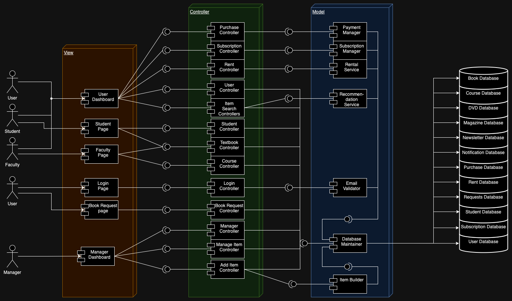

# LibManager

An Open Source app made for libraries to make their system accessible to the public. LibManager, is a **Library Management App** that can be utilised by the library as well as different types of consumers such as students and faculty members. Equipped with multiple features that make lives easier for users as well as managers of the system. Some notable features include login and registration, renting, student dashboard, faculty dashboard etc.

## System

The project is based on the Model-View-Controller (MVC) architecture. The front end used for this project is Swing. Here is a sketch of the system diagram:

## Getting Started

### Prerequisites

* This system uses Java 17.
* This system uses Maven as its build system.

### Installing

1) Clone the [GitHub Repository](https://github.com/ahan10/LibManager) or download the source code for [Final Release](https://github.com/ahan10/LibManager/releases/tag/FinalRelease) and import it in a Java Compiler.

2) To run the project, please run the [*Main.java*](https://github.com/ahan10/LibManager/blob/main/src/main/java/org/team4/Main.java) file.

*Note: To use the system, the stub data can be used to login, which can be found in [database](https://github.com/ahan10/LibManager/tree/main/database) folder as [users.csv](https://github.com/ahan10/LibManager/blob/main/database/users.csv).*

### Testing

The app has been thoroughly tested by us as well as random testing has been done using Randoop. The tests can be found on the [testBranch](https://github.com/ahan10/LibManager/tree/testBranch). To run the tests:

1) Clean the project by running the following command in the command line:

> mvn clean

2) After cleaning the project run the tests by running the following command in the command line

> mvn test

The system is equipped with plugins such as [JaCoCo](https://www.jacoco.org) for code coverage and [Maven Surefire Report](https://maven.apache.org/surefire/maven-surefire-report-plugin/index.html) for test report, which gives the reports for the tests run, the reports can be found in:

* For code coverage: target folder > site > jacoco > index.html
* Fore Surefire Report: target folder > site > surefire-report.html

### Build System

[Maven](https://maven.apache.org) - Dependency Management

## Features

*Please refer to wiki for the list of features.*

## Author
    Ahan Bhargava
